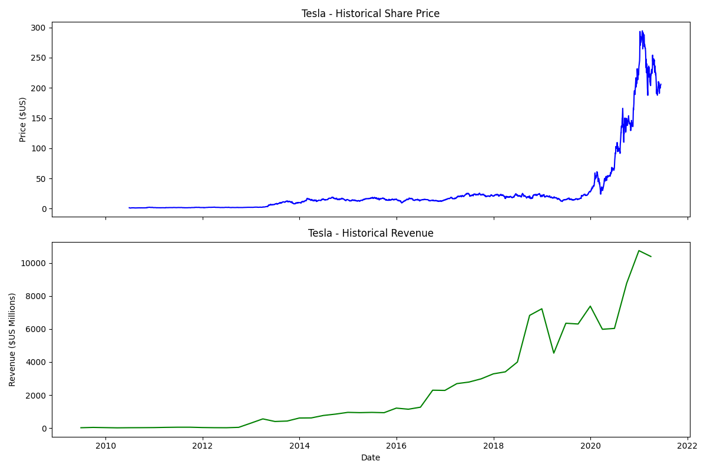

# Tesla Stock vs Revenue Analysis 

##  Overview

This project analyzes Tesla's stock price and revenue trends over time.

* Stock data fetched using `yfinance`
* Revenue data scraped using `BeautifulSoup`
* Data cleaned and visualized using `pandas` and `matplotlib`

## Features

* Historical stock price visualization
* Revenue trend analysis
* Side-by-side comparison using graphs

##  Technologies Used

* Python
* pandas
* matplotlib
* BeautifulSoup
* yfinance

##  How to Run

1. Install dependencies:

```bash
pip install -r requirements.txt
```

2. Run the script:

```bash
python main.py
```

## Output



##  Learnings

* Web scraping using BeautifulSoup
* Data cleaning with pandas
* Time-series visualization
